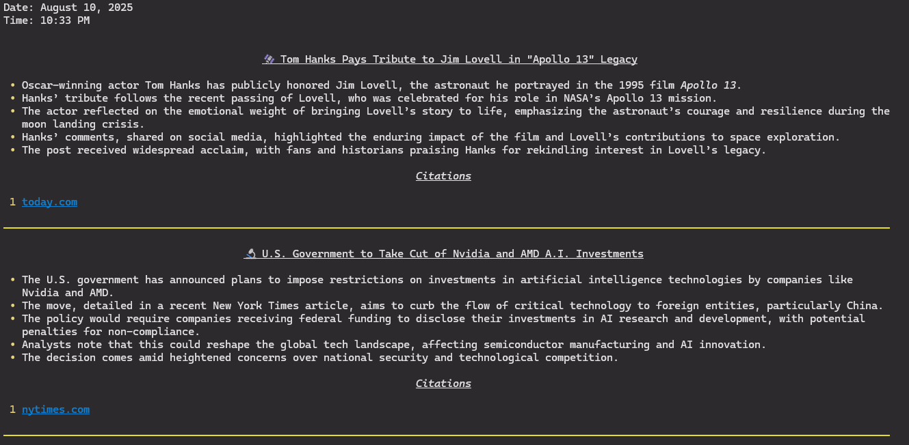
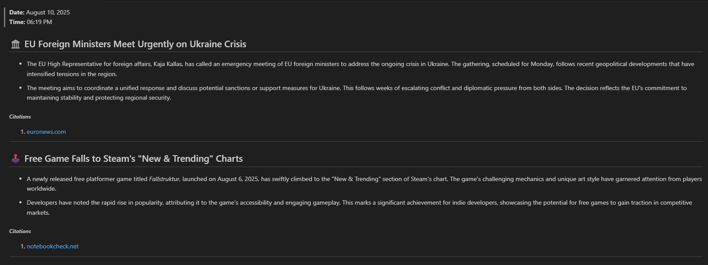

# 📰 News Summary Tool

An AI-powered CLI tool that fetches and summarizes news articles from multiple sources, providing concise and informative summaries for quick consumption. Built with flexibility to support multiple LLM providers including local models.

## ✨ Features

- **News Search**: Uses search engine (option between duckduckgo and google) to fetch current news on the provided topics

- **Flexible LLM Support**: Choose from multiple AI providers:
  - Ollama (Local models)
  - OpenAI (GPT-4, GPT-3.5)
  - Anthropic (Claude)
  - etc.

- **Smart Summarization**: Uses AI to create:
  - Focus on readability
  - Source attribution

- **Configurable Output**: 
  - Structured markdown reports
  - Custom file naming
  - Individual agent summaries

## Sample reports

### Rendered to terminal




### Markdown file



## 🚀 Quick Start

### Prerequisites

- Python 3.13+
- uv (for package management). uv is recomended althought pip should work fine as well
- API keys for your chosen LLM provider

### Installation

1. **Clone the repository**:
   ```bash
   git clone <repository-url>
   cd tldr-news-agent
   ```

2. **Install dependencies**:
   ```bash
   uv sync
   ```

3. **Configure environment**:
   ```bash
   cp .env.example .env
   # Edit .env file with your API keys
   ```

4. **Run the tool**:
   ```bash
   # Generate full news report
   uv run python main.py

   # Or using the CLI
   uv run python main.py run
   ```

## 🔧 Configuration

### Environment Variables

Create a `.env` file with your API keys:

```env
# OpenAI
OPENAI_API_KEY=your_openai_api_key_here

# Anthropic
ANTHROPIC_API_KEY=your_anthropic_api_key_here

```

### LLM Provider Configuration

The tool supports multiple LLM providers. Note that LLM needs to be support tool usage.
Edit `src/config.yaml` to configure:

```yaml
llm:
  provider: "openai"  # openai, anthropic, ollama, azure-openai
  
  models:
    openai:
      model: "gpt-4o-mini"
      api_key_env: "OPENAI_API_KEY"
    
    ollama:
      model: "llama3.2:3b"
      base_url: "http://localhost:11434/v1"
```

### For Ollama (Local LLM)

1. **Install Ollama**: Follow instructions at [ollama.com](https://ollama.com)

2. **Pull a model**:
   ```bash
   ollama pull llama3.2:3b
   ```

3. **Update configuration**:
   ```bash
   # Use Ollama provider
   uv run python main.py run --provider ollama
   ```

## 📋 Usage

### Basic Usage

```bash
# Generate full news report with default settings
uv run python main.py

# Generate full news report with default settings and renders on console
uv run python main.py --display

# Generate with specific LLM provider
uv run python main.py run --provider ollama

# Save to custom file
uv run python main.py run --output my_news_report.md

# Verbose output
uv run python main.py run --verbose
```

### CLI Commands

```bash
# List available LLM providers
uv run python main.py list-providers

# Show help
uv run python main.py --help
```

## 📄 License

This project is licensed under the MIT License - see the [LICENSE](LICENSE) file for details.

## 🙏 Acknowledgments

- Built with [Pydantic AI](https://ai.pydantic.dev/)
- Supports multiple search engines - Google and DuckDuckGo for news search. Default is [DuckDuckGo](https://duckduckgo.com/)
- Console markdown rendering supported by [Rich](https://github.com/Textualize/rich)
- CLI support using [Click](https://github.com/pallets/click)